# Architecture Diagrams

This document provides visual representations of the UDP send path improvements.

## Current vs New Architecture

### Before: Direct Queue-to-Socket Model

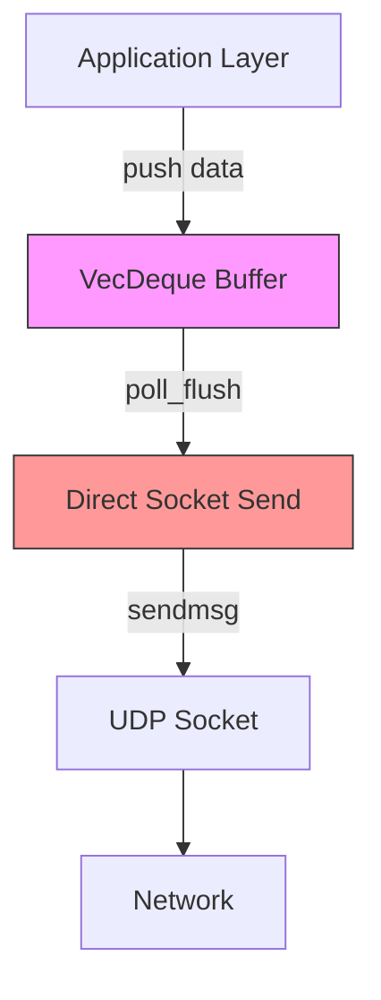

**Problems:**
- Custom memory allocator (complex)
- No flow control backpressure
- Naive pacing (yield every 5 packets)
- No completion feedback

### After: Wheel-Based Pacing Model

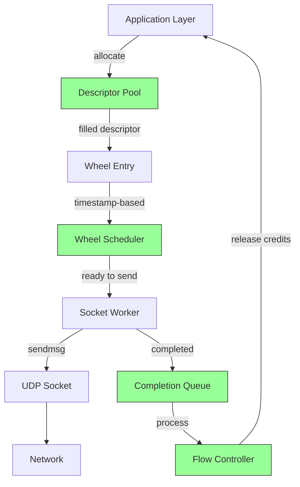

**Benefits:**
- Unified memory management
- Flow control with backpressure
- CCA-driven pacing
- Feedback loop for RTT/loss

---

## Work Item Dependencies

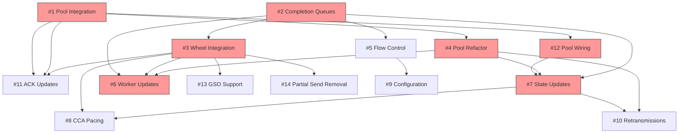

**Legend:**
- Red nodes: P0 (Critical) - Must be done first
- Default nodes: P1-P2 - Can be done later

---

## Implementation Phases

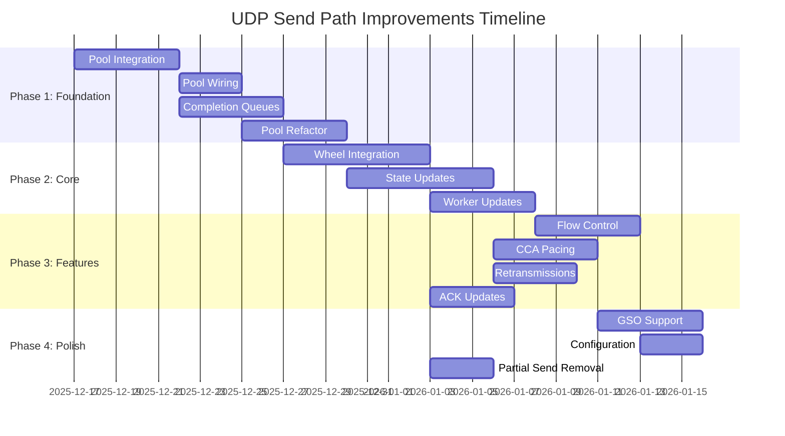

---

## Data Flow

### Sending Data (New Architecture)

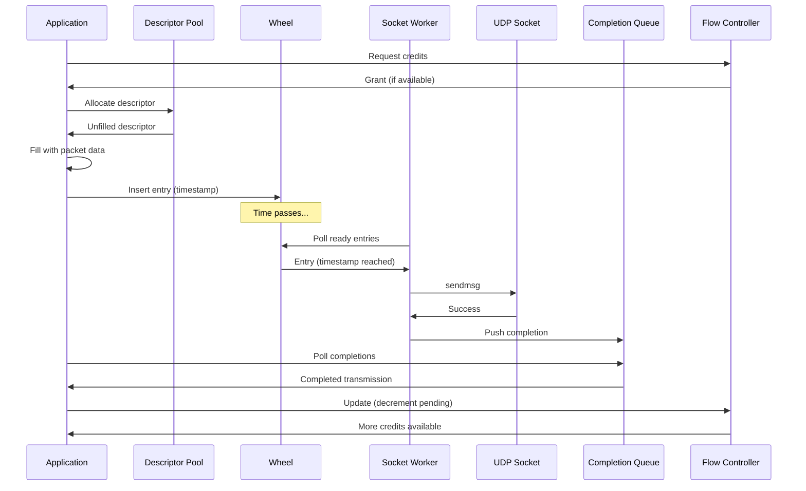

### Retransmission Flow

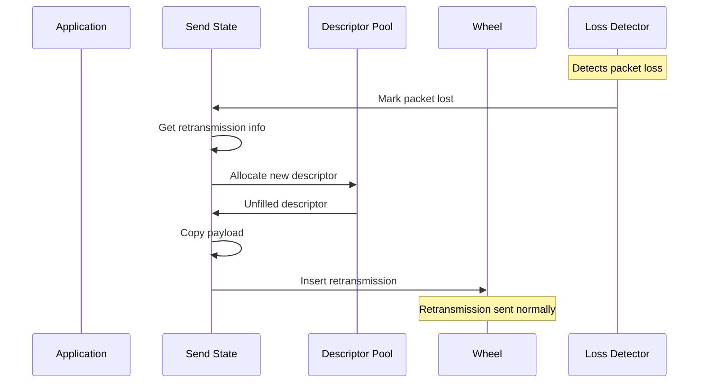

---

## Flow Control State Machine

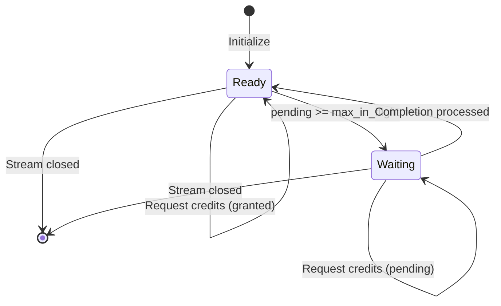

---

## Pool Lifecycle

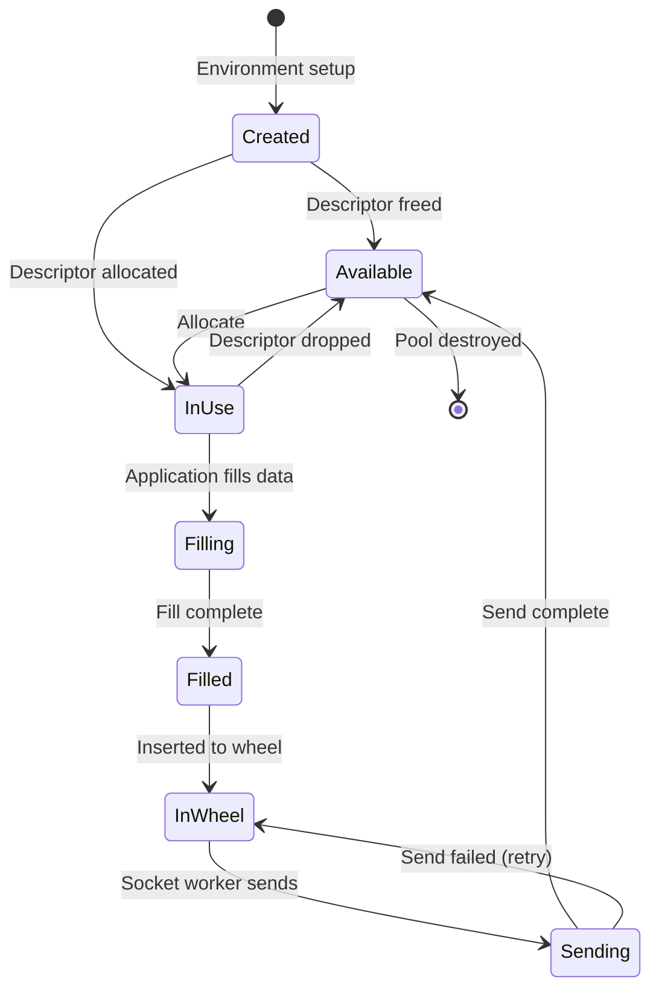

---

## Component Interactions

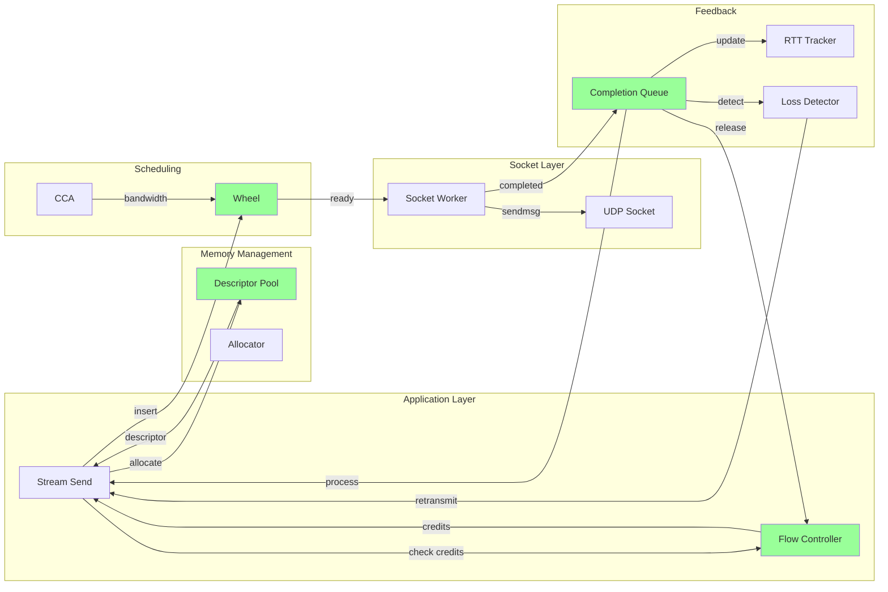

---

## Test Coverage Hierarchy

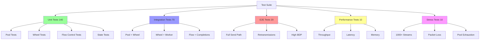

---

## Risk Areas

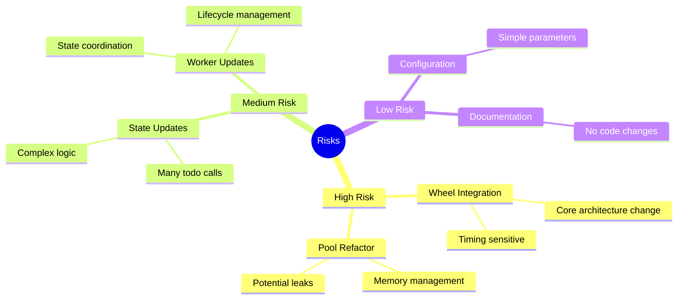

---

## Success Metrics Dashboard

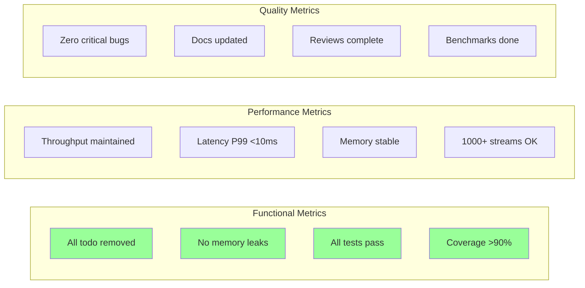

---

## GitHub Rendering

These Mermaid diagrams are rendered automatically by GitHub when viewing this file in the repository. For best viewing experience, use the GitHub web interface.

## Diagram Sources

All diagrams in this document are generated using Mermaid.js syntax. To edit:

1. Copy the mermaid code block
2. Use the [Mermaid Live Editor](https://mermaid.live)
3. Make changes
4. Copy back to this file

## Related Documents

- See `INVESTIGATION_SUMMARY.md` for detailed architecture discussion
- See `WORK_ITEM_STATUS.md` for current status
- See `TEST_COVERAGE_PLAN.md` for test specifications
- See `udp-improvements.md` for technical details
