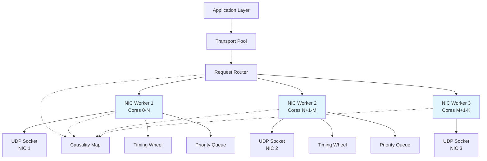
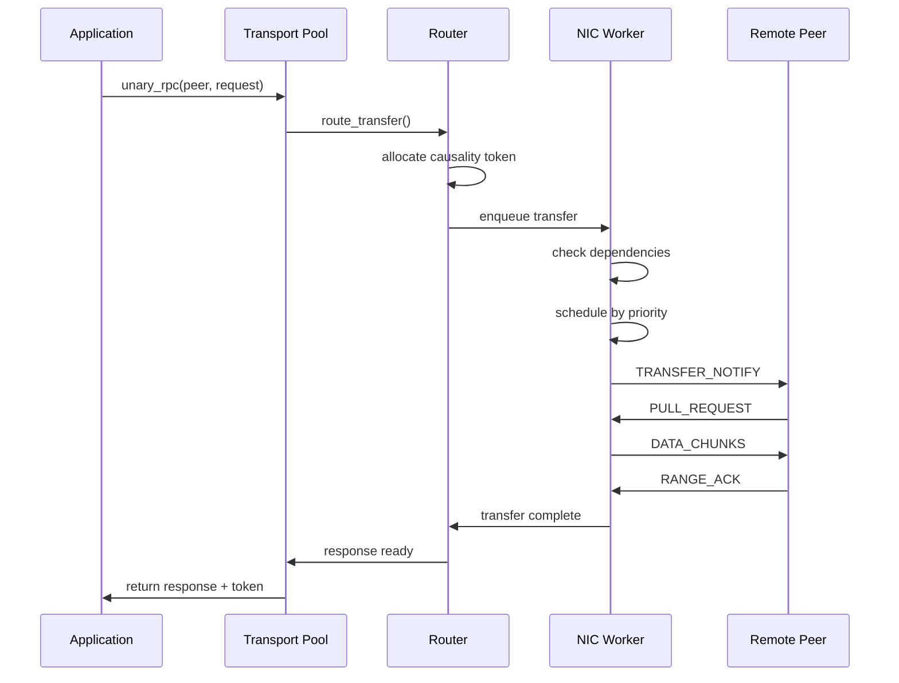

# Transport Layer Refactor Design

## Background

### Current System Overview

The existing transport implementation uses a byte stream abstraction built on top of UDP sockets. Each RPC request creates a new stream with its own encryption key. The system uses a worker-based architecture where send and receive operations are handled by separate worker tasks that poll sockets. Each stream spawns two dedicated workers - one for sending and one for receiving.

### Problems

**Concurrency and Bandwidth Utilization**

We are implementing a distributed database implementation that uses multi-paxos with individual RPC calls requiring coordination across hundreds to thousands of peers. A single transaction generates tens of thousands of concurrent RPC requests that all transmit simultaneously. This burst pattern overwhelms available bandwidth on both local and remote network interfaces.

Current measurements show approximately 20% goodput - meaning only 20% of transmitted packets contribute to forward progress. The remaining 80% consists of retransmissions and control packets. This occurs because all streams burst simultaneously without coordination, causing widespread packet loss.

**Single NIC Limitation**

Deployment environments include machines with up to 8 NICs providing 3.2 Tbps aggregate bandwidth. The current architecture can only utilize a single NIC, leaving substantial bandwidth unused.

**Replay Protection Scalability**

The remote peer cannot guarantee replay detection for all initial packets due to the volume of concurrent streams. Currently the secret map tracks 2^16 stream IDs per peer, which in aggregate adds quite a bit of storage costs just for secret tracking. This limited window results in the peer rejecting legitimate streams that arrive out of order leading to spurious stream retries and more wasted work. These retries all end up competeing with each other causing more to spuriously get rejected or experience loss.

**Stream Abstraction Overhead**

The byte stream abstraction is application-agnostic, treating all transfers as undifferentiated byte sequences. This prevents the transport from optimizing for actual usage patterns: unary RPCs, streaming responses, streaming requests, bidirectional channels, and raw bulk transfers. The transport cannot make informed scheduling decisions because it lacks semantic understanding.

**Causal Ordering**

Because each stream operates independently from each other, it isn't possible to natively express dependencies between messages. This forces the client application to implement it with imperfect knowledge and reduced scalability due to needing to wait for the entire response to be received on the previous message before sending the next. This means we get no message pipelining at all per peer, per transaction.

**Encryption Key Proliferation**

Each stream derives its own encryption key, creating substantial overhead when tens of thousands of streams are active. This also complicates replay detection since receivers must track key IDs for every stream independently.

**Timing and Scheduling**

Attempts to retrofit timing wheel and busy polling mechanisms into the current architecture have resulted in bugs and architectural friction. The worker-based model with async/await abstractions conflicts with the need for precise timing control and busy-loop execution on dedicated cores.

## Requirements

### Performance

The system must support burst transmission of 10,000 or more concurrent streams to hundreds of peers simultaneously. Under these burst conditions, goodput must maintain as close to 100% as possible, compared to the current 20%. All available NICs must be utilized when multiple NICs are configured. The architecture must scale to machines with up to 192 CPU cores and handle aggregate bandwidth up to 3.2 Tbps across 8 NICs. Transmission latency for high-priority transfers must be minimized. The system must support assignment of dedicated CPU cores that execute busy polling loops.

### Protocol Features

The transport must support five distinct transfer patterns: unary RPC (single request, single response), streaming response (single request, multiple responses), streaming request (multiple requests, single response), bidirectional (multiple requests and responses), and raw bulk transfer (direct memory or disk placement with optional cache teeing). All of the patterns should support optional request headers and or response headers. Priority-based scheduling must be enforced across all active transfers. The system must track causality relationships between transfers, supporting both critical dependencies (failure propagates) and optional dependencies (failure does not propagate). Transient failures require automatic retry without application intervention. Permanent dependency failures must be handled gracefully with appropriate error propagation. At a high level the transport shouldn't dictate encoding schemes for messages but it should be aware of what the application is wanting to do with the bytes.

The transport must support broadcast transfers where identical payload data is sent to multiple peers simultaneously. For multi-paxos replication scenarios, the same data must be replicated across numerous peers. The system must encrypt the bulk data once and reuse the encrypted payload for all peer destinations, avoiding redundant encryption overhead. Memory management must support a single buffer allocation that multiple peers can read via RDMA, with deallocation of ranges occurring only after all peers have completed their reads.

### Transport Support

EFA via libfabric is the primary transport for EC2 instances where available. UDP must function as a fallback on all platforms including those without EFA support. The system must support macOS for developer workstation environments. Integration with the Bach simulator is required for deterministic testing scenarios.

### Security

The existing path secret map mechanism must be maintained for peer authentication. Replay protection must function without per-stream overhead. Key rotation must occur without interrupting active transfers. Key derivation overhead must be minimized compared to the current per-stream approach.

### End-to-end backpressure

The transport must ensure that backpressure is maintained end-to-end. If the application is slow to read, then we don't want to build up an unbounded buffer of messages that need to be processed.

### Operational

The number of dedicated cores must be configurable at initialization. Core pinning to specific CPU IDs must be supported. Dedicated cores must be excluded from the kernel scheduler to prevent other processes from executing on them. The system must gracefully handle machines without EFA capability. Resource unavailability must result in graceful degradation rather than failure.

### Events visibility

The system must support emitting events into application-provided subscribers. These events should give deep insight into what is happening in the system. These events will then derive metrics to track the state of the system.

## Non-Goals

### Backward Compatibility

Wire protocol compatibility with existing implementation is explicitly not required. This enables fundamental protocol changes necessary to meet performance and functional goals.

### Dynamic Core Allocation

The system will not support dynamic adjustment of dedicated core count at runtime. Core assignment is determined at initialization.

### Fair Queueing

The system will not attempt to provide fair bandwidth allocation across peers or transfers. Applications explicitly control priority, and higher priority transfers receive preferential scheduling.

### Generic Stream API

The transport will not provide a generic byte stream interface compatible with standard I/O abstractions. Applications interact through transfer-specific APIs.

### Low-Resource Environments

The design targets high-core-count, high-bandwidth environments. Optimization for single-core or low-memory systems is not a goal.

## High-Level Architecture

### Data Flow

## Component Design

### Transport Pool

The transport pool serves as the single entry point for all application transfer requests. It manages worker lifecycle and provides transfer APIs that applications use to initiate communication with peers.

This component directly addresses the requirement for multiple transfer patterns. Rather than forcing applications to work with a generic byte stream abstraction, the pool exposes distinct methods for each transfer type: unary RPC, streaming response, streaming request, bidirectional, and raw bulk transfer. Each method accepts transfer options that specify priority and causality dependencies, giving applications explicit control over scheduling behavior.

The pool must be cheaply cloneable to support concurrent access from multiple application threads. This is achieved through Arc-based sharing of underlying state. Thread safety is essential since many application threads will simultaneously initiate transfers. The pool minimizes allocation per transfer request to maintain high throughput under burst load conditions.

#### Application-Worker Communication

The pool communicates with workers through ring buffers with separate queues per priority level. This enables workers to process higher-priority items first. Applications allocate and associate their own ring buffers for responses, creating a bidirectional channel with minimal synchronization and maximum allocation reuse.

When a worker's request queue fills up, the system applies backpressure to the application. The transport stores wakers to notify when new capacity becomes available, allowing async operations to resume.

Response delivery varies by transfer type:

- Single message responses use async oneshot channels
- Streaming responses use async streams
- Headers may use separate oneshot channels

Using the main interface, applications allocate a buffer region, encrypt data directly into it (avoiding copies), then submit the buffer ID to one or more RPC requests. This allows applications to decouple encrypting and preparing the data for transmission from the actual control messages to transmit the data. If the data is already encrypted, applications can opt-out of encryption and just authenticate the data.

### Request Router

The request router maps incoming transfer requests to appropriate NIC workers based on peer address and current load conditions. It also manages allocation of causality tokens from a shared pool.

This component directly addresses the multi-NIC utilization requirement. Without intelligent routing, all transfers would flow through a single NIC regardless of how many NICs are available. The router enables bandwidth scaling across available NICs while maintaining ordering guarantees where necessary.

Lock-free or minimal-locking design is essential because the router sits in the hot path for all transfer requests. With tens of thousands of concurrent transfers, contention on routing decisions would create a bottleneck. The router uses flow hashing to assign peers to workers, ensuring that all transfers to a given peer use the same worker. This maintains causal ordering within a peer's transfer stream without requiring cross-worker coordination.

When a NIC becomes overloaded, new peer assignments go to less-loaded NICs, but existing peer assignments remain stable. This prevents reordering issues that would occur if a peer's transfers were split across multiple workers. The router must handle NIC failure or removal gracefully by reassigning affected peers to surviving NICs.

### NIC Worker

Each NIC worker manages all transfer activity for a specific network interface. Workers own dedicated CPU cores and execute busy polling loops without yielding to the kernel scheduler.

This component directly addresses the dedicated core execution and busy polling requirements. The worker's single-threaded execution model eliminates locking overhead within the worker. CPU core pinning and kernel scheduler exclusion ensure that the worker maintains exclusive use of its cores, preventing context switches that would introduce latency. The polling-based approach avoids blocking on I/O or synchronization primitives, maintaining predictable timing behavior.

The worker executes a continuous polling loop. Each iteration polls the UDP socket for incoming packets, processes received packets, advances the timing wheel to handle scheduled events, checks the priority queue for transfers ready to transmit, and writes outgoing packets to the socket. This loop never yields or sleeps, providing microsecond-level timing precision.

Socket I/O uses non-blocking operations exclusively. The worker maintains separate receive and transmit buffers to decouple packet processing from transmission scheduling.

The worker notifies the local sender when any given transmission has been completed. This provides backpressure on senders that might otherwise overwhelm NIC workers with an unsustainable backlog.

#### Bandwidth Configuration and Traffic Shaping

Each NIC has its own leaky bucket state for traffic shaping. Applications specify the expected bandwidth at startup based on known deployment characteristics. The configuration remains static throughout runtime since bandwidth limits are determined by infrastructure and never change in production environments. For example, EC2 deployments commonly have per-flow limits of 5 Gbps and per-NIC limits of 25 Gbps.

The transport handles per-flow bandwidth limits differently based on the underlying transport mechanism. For UDP, the system uses port randomization to work around per-flow limits by allocating multiple ports and spreading bulk data transmission across them. This enables aggregating individual flow bandwidths up to the total NIC capacity. For instance, using 5 ports at 5 Gbps each achieves the 25 Gbps NIC limit. For RDMA via libfabric and EFA, per-flow VPC limits don't apply in the same way since EFA uses the SRD (Scalable Reliable Datagram) protocol which automatically spreads traffic across available paths. This enables achieving full NIC bandwidth without requiring port tricks, though the system still implements application-level rate limiting to avoid overwhelming the NIC.

The worker implements a classic leaky bucket algorithm rather than a token bucket to avoid any bursting behavior. The goal is to pace packets evenly at a precise rate that achieves the target bandwidth. Microbursts are acceptable only for GSO (Generic Segmentation Offload) coalescing optimizations. Token replenishment occurs based on time progression tracked during the worker's polling loop iterations.

The system uses 8 priority levels. The worker implements weighted fair queueing across these priority levels to ensure all priorities make some progress, preventing complete starvation of lower priorities even when higher priorities have continuous traffic.

When aggregate transfer demand exceeds the configured NIC bandwidth capacity, the system applies backpressure throughout the entire stack. The application experiences slower message submission rates, particularly for lower-priority transfers. The system also throttles opening new RPC flows when it cannot flush pending ones, with new low-priority flows being blocked if high-priority flows are waiting. This prevents the pathological scenario where the system takes on so much work that nothing makes meaningful progress.

#### Receiver-Side Bandwidth Control

Workers also control receiving bandwidth by rate-limiting `PULL_REQUEST` messages. This is particularly critical for incast scenarios such as paxos replicated reads where multiple replicas respond simultaneously and could overwhelm the receiver. The worker schedules reads based on pending response queue depth and uses the same priority levels for `PULL_REQUEST`s as for sends. When many pending responses are queued, the worker slows down issuing new `PULL_REQUEST`s to prevent being overwhelmed by simultaneous data from multiple peers. This receiver-side pacing complements sender-side congestion control to maintain end-to-end flow control. Additionally, receivers slow `PULL_REQUEST` messages when the application is slow to read from the message queue. This avoids buffering too much data on the receiver.

### Timing Wheel

Each worker contains a timing wheel for precise event scheduling. The wheel divides time into fixed-size slots, with each slot containing events scheduled for that time range.

This component addresses the precise timing control requirement. The current architecture's attempts to retrofit timing capabilities failed because async/await abstractions and tokio timers introduce unpredictable delays. The timing wheel provides deterministic scheduling within the worker's busy loop.

The wheel operates with sub-millisecond tick duration, providing fine-grained control over transmission timing. This enables precise pacing to avoid congestion while maintaining low latency. Events scheduled in the current or past slots fire immediately during wheel advancement. Future events remain queued until their slot becomes current.

The single-producer single-consumer nature of the timing wheel within a worker eliminates synchronization overhead. Only the worker thread inserts and removes events, so no atomic operations or locks are required. This design would not work in a multi-threaded context but is optimal for the single-threaded worker model.

### Priority Queue

Each worker maintains a priority queue of transfers ready for transmission. The queue orders transfers by priority level, with higher priority transfers scheduled before lower priority ones.

This component directly addresses the priority-based scheduling requirement. Applications need control over which transfers receive bandwidth when resources are constrained. Without priority scheduling, all transfers receive equal treatment regardless of importance.

The queue contains 8 priority levels, from 0 (highest) to 8 (lowest). Each level maintains a FIFO queue of transfers at that priority. When selecting the next transfer to schedule, the worker scans from highest to lowest priority and selects the first available transfer. This provides deterministic priority ordering while maintaining fairness within each priority level.

The single-threaded worker model again eliminates synchronization requirements. Only the worker accesses its priority queue, so no atomic operations are necessary. A bitmap tracks which priority levels currently have queued transfers, enabling efficient scanning without checking empty levels.

### Causality Map

The causality map tracks dependencies between transfers using a slot-based allocation scheme. Applications receive causality tokens as opaque identifiers that reference slots in the map.

This component addresses the causality tracking requirement issues. The current system forces applications to manually track causality relationships, which is error-prone and inefficient. By moving causality tracking into the transport layer, the burden shifts away from applications. It also opens up the transport to pipeline requests on a receiver and not be forced to wait for requests to be completed before transmitting.

#### Slot Allocation and Management

Slots are allocated only when needed. Applications must explicitly indicate they want causality tracking for a transfer. The map is designed to be resizable and growable to avoid becoming a bottleneck, since backpressure mechanisms exist elsewhere in the system. Slots are freed immediately when transfers complete.

The map uses a slot-based array structure. Each slot contains the current generation number, dependency list, and completion state. When allocating a causality token, the router selects an available slot, increments its generation, and returns a token encoding the slot index and generation. This encoding enables lock-free lookups since stale tokens can be detected by comparing generations.

#### Dependency Handling

Each slot supports an unbounded number of dependencies. While the majority of requests will have only a handful of dependencies, the system supports hundreds if applications require it.

Dependencies operate on two dimensions that determine their behavior: whether the system waits for the dependency's request or response, and whether errors cascade to dependent transfers. This yields four distinct dependency types that applications can select based on their requirements:

1. **Wait for Response + Cascade Error**: The dependent transfer waits until the dependency has completed its full request-response cycle. If the dependency fails, the dependent transfer fails automatically. This provides the strongest ordering guarantee and is used when subsequent operations require successful completion of previous operations.

2. **Wait for Request + Cascade Error**: The dependent transfer waits only until the dependency's request has been sent (but not for the response). If the dependency fails, the error cascades to the dependent. This enables pipelining where requests can be sent before responses arrive, while still maintaining failure atomicity across related operations.

3. **Wait for Response + Don't Cascade**: The dependent transfer waits for the dependency's full completion but continues processing even if the dependency fails. This is useful when operations should be ordered but failures shouldn't propagate.

4. **Wait for Request + Don't Cascade**: The dependent transfer waits only for the dependency's request to be sent and continues regardless of the dependency's outcome. This provides loose ordering with maximum concurrency.

The worker checks dependency states before scheduling a transfer. Transfers become eligible for scheduling only when all dependency wait conditions are satisfied. If any dependency that cascades errors has failed, the transfer is immediately failed. If all wait conditions are met (dependencies completed successfully or are of non-cascading types), the transfer proceeds to scheduling.

#### DAG Enforcement

The system enforces Directed Acyclic Graph (DAG) structure by design. When creating a request, applications provide a list of dependency tokens but don't yet know the causality token for the request being created. This prevents circular dependencies by construction - you cannot depend on something that doesn't exist yet.

The slot-based design provides constant-time lookup and update operations. Lock-free atomic operations enable concurrent access from multiple workers without contention. The growable design ensures the map scales with system load while maintaining predictable performance characteristics.

### Receiver-Driven Protocol

The wire protocol shifts control of data transmission from sender to receiver. Rather than immediately transmitting all data when a transfer is initiated, the sender notifies the receiver of the pending transfer and waits for the receiver to request data.

This protocol design addresses the bandwidth utilization and congestion problems. In the current system, all streams burst data simultaneously, overwhelming available bandwidth and causing packet loss. The receiver-driven approach allows receivers to control their incoming bandwidth and schedule data pulls based on local resource availability.

The protocol consists of four message types. `TRANSFER_NOTIFY` messages announce a list of pending transfers, containing transfer metadata, size, causality information, and priority. For small transfers, the notify message can include the complete payload inline, avoiding the need for subsequent data exchange. The transport should pace the number of inline messages. If the system becomes overloaded, inline messages should be disabled in order to support more concurrent requests. `PULL_REQUEST` messages from receiver to sender specify which byte ranges to transmit and explicitly communicate pacing rates that should be respected by the sender. `DATA_CHUNKS` messages carry the actual encrypted payload data in requested ranges. `RANGE_ACK` messages provide precise acknowledgment for received ranges. The sender can then free up the resources associated with these ranges for future transmissions. For any lost ranges, another `PULL_REQUEST` message would be sent by the receiver for the range that is missing. The `PULL_REQUEST` should indicate if the request is a retransmission request so the sender can potentially act on that information.

The receiver maintains precise knowledge of which data ranges it has successfully received. This enables accurate loss detection without ambiguity. When packet loss occurs, the receiver knows exactly which ranges need retransmission and requests them specifically. This is more efficient than the sender inferring loss from missing acknowledgments, especially under high concurrent load.

Receivers can pipeline transfer requests, sending pull requests for dependent transfers before their dependencies have completed transmission. When a dependency completes, queued pull requests for dependent transfers are already waiting, eliminating round-trip latency. This pipelining is safe because the causality system ensures logical ordering is maintained even when physical transmission is reordered.

#### Receiver State Management

Both sender and receiver sides run dedicated workers with busy polling, using the same architectural approach. Since all communication is bidirectional (even simple request/response patterns), both sides require identical infrastructure. There is simply an initiator (client) that starts each flow.

On the receiver side, the server uses an acceptor trait that gets called for each new incoming flow. The application decides how to handle each flow:

- Spawn a tokio task to process it
- Reject it (e.g., when under load)
- Queue it without immediate processing

To enable proper RPC handler dispatch, `TRANSFER_NOTIFY` messages include application metadata about transfer contents. This metadata allows routing to the correct handler without needing to decrypt the payload first.

Received data storage uses a reassembler buffer for encrypted data. Once ready to decrypt, the system either decrypts directly into application-provided buffers or handles inline transfers by providing BytesMut directly to the application.

Receiver-side backpressure operates through multiple mechanisms working in concert. The primary mechanism is implicit: receivers simply stop sending `PULL_REQUEST` messages when they cannot accept more data. Applications configure this behavior per-stream at creation time by specifying two limits: a message queue depth and a byte limit. When the queue reaches capacity on either dimension, the worker stops issuing `PULL_REQUEST` messages. The byte limit can be exceeded if necessary to complete a partially-buffered message, preventing deadlock scenarios where the system cannot make progress.

The receiver may also explicitly cancel outstanding pull requests using `CANCEL_PULL` messages, though cancellation is not guaranteed due to in-flight messages that may arrive before the cancellation is processed. Receivers send `PULL_REQUEST` messages immediately when bandwidth is available and queue space exists, up to the configured limits. Batching optimization coalesces multiple range requests to improve efficiency.

The receiver also provides explicit flow control to the sender through a credit system embedded in `TRANSFER_ACCEPT` messages. When acknowledging received notifications, the receiver includes a sequence ID indicating how many additional `TRANSFER_NOTIFY` messages the sender may transmit. This provides explicit rate limiting of notification bursts, preventing the receiver from being overwhelmed by notification traffic before it has processed existing transfers. The credit system complements the implicit backpressure of absent `PULL_REQUEST` messages, providing both coarse-grained (notification-level) and fine-grained (data-level) flow control.

When the sender's buffer pool approaches capacity, it applies backpressure to the application to prevent unbounded buffer growth. Applications specify a maximum buffer pool size during initialization. The sender tries to clear buffer space by obtaining range acknowledgments from peers, but if buffers remain occupied, new allocation requests from the application experience backpressure. Lower-priority transfers are throttled more aggressively than high-priority transfers, ensuring critical work continues making progress even under resource pressure.

#### Transfer Identifiers

Transfer identifiers are globally scoped across all peers and workers to enable easy routing of responses to the correct destination. The initiator creates the identifier before sending `TRANSFER_NOTIFY`. Both sides maintain their own local transfer IDs - the sender has a local ID and the receiver has a local ID. IDs are echoed in protocol messages (e.g., `PULL_REQUEST` includes the receiver's local ID, and `DATA_CHUNKS` echoes it back for routing).

Transfer IDs use a 64-bit structure split into two halves:

- One half contains the generation ID (which may include worker ID bits to avoid cross-worker coordination)
- The other half contains the slot ID
- Generation wraparound is acceptable since the window is large enough to avoid confusion

A slot allocator manages ID generation. Embedding worker ID bits in the generation eliminates the need for worker coordination, enabling better concurrency. The same transfer ID is reused for retries to enable receiver deduplication.

#### Replay Protection with Challenge-Response

The system implements a tracking window for replay detection. For `TRANSFER_NOTIFY` messages that fall outside the tracking window, the system uses a challenge-response mechanism:

1. Receiver challenges the sender via `PULL_REQUEST`
2. Sender responds via `DATA_CHUNKS` if the transfer is still valid
3. If the transfer ID now maps to a different transfer, the sender sends a `FLOW_RESET` message indicating the notification is not genuine

This approach allows the system to handle high-volume scenarios where maintaining a full replay window for every possible transfer would be impractical.

### Encryption Key Pool

Rather than deriving a separate encryption key for each stream, the transport maintains a small pool of keys shared across transfers to a given peer. Each dedicated worker uses a local key to avoid having to synchronize any nonces across workers.

#### Key Types and Usage

The system uses two distinct key types that serve different purposes. Control keys are derived from the TLS+QUIC handshake with each peer and are used to authenticate control messages such as TRANSFER_NOTIFY and PULL_REQUEST. Each worker derives these control keys locally per peer, avoiding any cross-worker coordination overhead. Data keys are generated on-the-fly for each transfer or buffer and are sent across the wire encrypted by the control keys. These keys optionally encrypt and authenticate application payloads and enable efficient broadcast scenarios by distributing the same key to multiple peers. Both key types use AES-GCM for their cryptographic operations.

The control messages bind application data to control metadata by adding the application-data sequence number and/or authentication tag to the Additional Authenticated Data (AAD). This binding allows bulk data to be encrypted in larger chunks than the MTU would otherwise permit. Because the transport now understands message boundaries rather than treating everything as an undifferentiated byte stream, this approach avoids head-of-line blocking since messages (not packets) are the units of work for the application.

Receivers cache the AES key schedule for data keys since key schedule generation is an expensive operation. The key value itself serves as the identifier in this cache, avoiding the overhead of maintaining separate key identifiers.

#### Key Rotation

Control keys rotate based on usage thresholds. Rotation is triggered when both `N` bytes have been transmitted OR `M` packets have been sent using the current key. The rotation process simply bumps the key ID, which deterministically derives the next key from the root path secret established during the TLS handshake. No coordination is required between peers since the key ID embedded in each message determines which key to use for verification. Each worker maintains its own control keys per peer and derives new keys locally as needed.

Workers require notification when a control key becomes invalidated, which occurs through the `UNKNOWN_PATH_SECRET` message inherited from the current implementation. The system may also implement an optional `RETIRE_KEY` message that signals receivers they can stop caching old control keys, enabling more aggressive cache cleanup. This message would use a separate key derived per peer path secret, following the same pattern used for other secret control messages in the current system.

Data keys have a simpler rotation model. The system generates data keys as needed and is included in the packet. Each transfer pins its data key when starting to ensure consistency throughout the transfer lifecycle. Senders typically don't keep old data keys for long periods, while receivers may need to cache keys longer to support out-of-order decryption. Data keys can rotate independently from control keys since they serve different purposes and have different lifetimes.

#### Nonce Management

Nonces use monotonic counters for simplicity and correctness. Since each worker maintains its own keys, no coordination is needed between workers for nonce generation. This per-worker isolation naturally prevents nonce reuse across workers, eliminating a major source of potential security vulnerabilities.

#### Benefits

This design addresses the encryption key proliferation problem that plagued the current implementation. With tens of thousands of concurrent streams, deriving individual keys for each stream creates substantial computational overhead. The pooled control key approach reduces this to a manageable number of keys per peer. Data keys enable efficient broadcast scenarios without requiring re-encryption of payload data for each destination peer. Replay detection becomes simpler since receivers only need to track control key IDs rather than per-stream key identifiers.

Application threads perform the bulk data encryption and decryption work. This enables spreading the CPU load across all available cores rather than concentrating encryption work on the worker threads. Applications acquire a unique sequence number and data key for each message they encrypt.

### Multi-NIC Load Distribution

The router distributes peers across available NICs using flow hashing with load-based overflow handling. Each peer flow is assigned to a worker by using the "pick 2" algorithm and taking the least-loaded worker. This ensures consistent assignment across the peer's lifetime. If a flow has dependencies, then it gets assigned to the same NIC as the dependencies.

This design addresses the multi-NIC utilization requirement while maintaining ordering properties. Assigning flow "groups" to NICs avoids reordering issues that would occur if a peer's transfers were split across workers.

When NIC load becomes imbalanced, existing peer assignments remain stable to maintain ordering. This trades perfect load balancing for correctness, which aligns with the non-goal of fair queueing.

The system detects NIC failure through worker health monitoring. When a NIC fails, active transfers on the failed NIC are retried on a new NIC. The causality system ensures correct ordering is maintained despite the retry.

### Transfer State Management

Each transfer maintains state tracking its progress through the lifecycle: dependency checking, priority scheduling, notification sent, awaiting pull request, transmitting chunks, and completion. State transitions occur within the worker's polling loop based on events and timing.

State management must be lock-free since workers access transfer state continuously during polling. Atomic operations provide synchronization where needed, such as when marking dependencies complete. The majority of state transitions occur within a single worker and require no synchronization.

Transfer state includes buffer references for payload data, destination information for raw transfers, causality token for completion notification, and priority for scheduling. Memory management uses reference counting to ensure buffers remain valid while transfers are in flight but are freed promptly upon completion.

#### Transfer Timeout and Retry Behavior

The system implements granular timeouts for each protocol phase to enable fast recovery from packet loss while avoiding premature failure detection. The most critical timeout concerns `TRANSFER_NOTIFY` messages, which must be retransmitted until the sender receives either a `TRANSFER_ACCEPT` or `TRANSFER_CHALLENGE` response. Maintaining a separate timer here allows new requests to fail fast and allow for existing requests to try and finish. These retransmissions use exponential backoff starting at three times the observed round-trip time, similar to QUIC's Probe Timeout (PTO) mechanism. The same retry-with-backoff approach applies to `PULL_REQUEST` and `DATA_CHUNKS` messages.

The system implements quick recovery optimizations that detect implicit loss signals. When a receiver sends `TRANSFER_ACCEPT` for a later `TRANSFER_NOTIFY` while an earlier notification remains pending, this indicates the earlier notification was lost and triggers immediate retransmission. The same logic applies to `PULL_REQUEST` and `DATA_CHUNKS` message pairs, enabling fast recovery without waiting for timeout expiration.

Streams time out at the peer level rather than the transfer level. Individual protocol phase timeouts continue backing off exponentially as long as some peer activity is observed. When peer liveness probes fail entirely, all active streams to that peer time out simultaneously. Any packet received from the peer resets the backoff timers since this indicates the peer remains alive even if specific messages were lost. Additionally, any packets sent toward a peer count as a probe packet as to not overwhelm a peer with large bursts of probes.

For transfers with causality dependencies, timeouts trigger cascading failures through the dependency graph, as long as dependencies have enabled cascade.

Buffer cleanup after timeout occurs automatically through the reference counting mechanism. When a transfer times out, the system cleans up the transfer's state which decrements the associated buffer's reference count. If the reference count reaches zero, the buffer is freed back to the pool. For broadcast scenarios, the buffer remains available for successful streams even when some streams time out, ensuring partial failures don't block progress on healthy peers.

### Buffer Management and Transfer Lifecycle

All transfers use a buffer management system based on reference-counted buffers identified by unique buffer IDs. This design supports both single-peer transfers and broadcast scenarios where multiple peers reference the same encrypted payload.

This component addresses both efficient memory management for individual transfers and the broadcast requirement for multi-paxos replication.

#### Buffer Registry and Allocation

The Transport Pool allocates buffer memory regions during initialization. These regions support NUMA-aware allocation where applications can request buffers from specific worker NUMA nodes for optimal performance, though this is not a hard requirement. For broadcast buffers that will be shared across multiple workers, strict NUMA placement may not be feasible.

The transport maintains a global buffer registry shared across all workers. The registry must support highly concurrent access from multiple application threads and workers, likely requiring partitioning for scalability. The registry uses a slot map or similar structure to provide O(1) lookup time with minimal indirection in the hot path. This performance is critical since buffer lookups occur for every data transmission and reception operation. The registry tracks the memory address associated with each buffer ID, enabling workers to directly access buffer contents through thin pointers.

Applications interact with the buffer system through a well-defined lifecycle API. The application calls `allocate_buffer(size)` which returns a handle to a buffer descriptor. Since messages may span multiple memory blocks, the buffer descriptor is implemented as a list of memory regions. The descriptor moves through explicit lifecycle states: allocated (reserved but not written), writing (application populating data), and filled (data complete and ready for transmission).

Applications can operate in two modes when populating buffers. In the first mode, applications copy already-encrypted and authenticated data directly into the allocated buffer. The application must specify which region to use for authenticating control messages, creating a binding between the payload data and control metadata for security. In the second mode, applications submit plaintext data to be encrypted into the provided buffer by the transport. The GHASH authentication tag serves as the binding region in this case. Both modes avoid extra copies by writing directly to the final transmission buffer.

Once filled, buffers become cloneable and can be passed to multiple streams. These streams hold references to pre-encrypted and pre-authenticated buffer contents. Reference counting tracks all streams using each buffer, and the buffer is freed back to the pool only when all references are released.

For streaming scenarios, buffers are allocated on-demand as streaming messages arrive. The system supports batch allocation patterns where multiple stream messages can be merged into the same buffer allocation when beneficial. This amortizes allocation overhead across multiple messages while maintaining the ability to handle individual messages as needed.

Workers hold reference-counted pointers to the buffer memory regions, ensuring that thin buffer pointers remain valid throughout buffer lifetime. This enables workers to dereference buffer metadata directly without additional indirection or validation overhead.

#### Buffer Lifecycle

When the application initiates a transfer, it encrypts the bulk payload data once with an ephemeral key and assigns it a unique buffer ID. The buffer ID is a 64-bit identifier consisting of a sequence number and a generation counter, which prevents ambiguity when buffers are recycled. The encrypted buffer is placed in the shared memory region managed by the global registry.

Each `TRANSFER_NOTIFY` message includes the ephemeral data key and buffer ID that reference the encrypted payload. The data key enables receivers to decrypt and authenticate the bulk data after retrieval. The buffer ID identifies which shared buffer contains the encrypted payload. Both the data key and buffer ID are included in the control message's Additional Authenticated Data (AAD) for authentication. This binding prevents attackers from redirecting legitimate payloads to unauthorized peers, since control message authentication will fail if the data key or buffer ID don't match.

Buffer lifecycle is managed through atomic reference counting. When a buffer is allocated, its reference count is initialized to the number of transfers that will reference it. For single-peer transfers, this count is 1. For broadcast transfers to N peers, the count is N. As each peer completes reading its ranges and sends `RANGE_ACK` messages, the corresponding transfer's reference to the buffer is released and the reference count decrements. The buffer is deallocated and returned to the pool only when the reference count reaches zero, ensuring all referencing transfers have completed.

This approach handles partial failures gracefully. If some peers in a broadcast fail or are slow to respond, the buffer remains available until all successful transfers complete. Timeouts or explicit cancellation can force reference release for failed transfers, preventing unbounded buffer retention.

#### RDMA Memory Registration

For RDMA-capable transports, workers handle memory registration with the NIC since workers have the knowledge of which transport is actually being used. When a buffer needs to be transmitted via RDMA, the appropriate worker registers it with libfabric. For broadcast scenarios where the same buffer must be sent to peers on multiple NICs, the buffer is registered multiple times with libfabric - once per destination NIC. Each deregistration decrements the buffer's reference count, and the final deregistration returns the buffer to the pool.

The buffer registry includes memory keys that receivers use to perform direct RDMA reads. This registration happens lazily when the buffer is first needed rather than proactively during allocation.

#### Transfer Independence

Transfer priority and causality operate independently from buffer management. Each transfer has its own priority and causality token regardless of whether it shares a buffer with other transfers. This enables fine-grained control where higher-priority transfers can receive data before lower-priority transfers, even when they reference the same payload buffer. The causality system tracks dependencies per transfer, so transfers sharing a buffer can have different dependency relationships.

For RDMA-capable transports, the buffer registry includes memory keys that receivers use to perform direct reads. For UDP fallback, workers respond to `PULL_REQUEST` messages by reading from the buffer and constructing `DATA_CHUNKS` messages. The unified buffer management approach ensures identical semantics across transport types.

### Peer Health Monitoring and Failure Recovery

The transport maintains health state for each peer to avoid prolonged transmission attempts to unresponsive or failed peers. This prevents wasting bandwidth and buffer resources on transfers that cannot complete.

This component addresses the operational requirement for graceful failure handling. Without health monitoring, the system would continue attempting transfers to failed peers indefinitely, consuming resources and degrading performance for healthy peers. The challenge lies in distinguishing permanent failures from transient overload conditions.

#### Peer Liveness Monitoring

The system monitors peers only when outstanding streams or transfers exist. This avoids redundant monitoring where every active flow independently tracks the same peer. The transport tracks the last time it received any packets from each monitored peer. When no activity has been observed for a threshold duration, the transport sends PROBE messages to check peer liveness. If the peer is still active, it responds with a PROBE_RESPONSE message. This lightweight probing mechanism provides a single monitoring point per peer rather than per-flow monitoring, reducing overhead while maintaining awareness of peer health.

Transfer timeouts trigger peer failure detection. When a transfer times out, this signals that the peer may have become unavailable. The timeout serves as the primary indicator for initiating health state transitions in the state machine described below.

#### Health State Machine

Each peer has an associated health state machine with four states: healthy, degraded, probing, and failed. Transitions occur based on transfer outcomes and timeout events. Workers update peer health based on their observations of transfer success and failure.

Healthy state represents normal operation where transfers succeed at expected rates. Peers begin in this state. Workers track success and failure rates using an exponentially weighted moving average. When the failure rate exceeds a threshold over a sliding window, the peer transitions to degraded state. This threshold must be high enough to tolerate normal packet loss rates but low enough to detect genuine peer problems.

Degraded state indicates elevated failure rates that may represent transient overload or degraded network paths. New transfer requests from the application continue to be accepted but are marked as lower priority internally. Workers apply backoff to transmission attempts, giving the peer time to recover. If failures continue, the peer transitions to probing state. If success rates improve above the healthy threshold, the peer transitions back to healthy.

Probing state occurs when failure rates remain elevated beyond the degraded state timeout. The transport stops accepting new transfer requests for this peer and returns errors to the application immediately. This prevents queue buildup and resource waste. However, existing in-flight transfers continue their retry cycles with exponential backoff. Additionally, the transport periodically sends PROBE messages to test peer responsiveness. If probes succeed consistently, the peer transitions back to degraded state. If probes fail beyond a timeout threshold, the peer transitions to failed state.

Failed state indicates the peer is not responding to any traffic. The transport rejects all new transfer requests immediately. Periodic probing continues at a reduced rate to detect peer recovery. When probes succeed, the peer transitions to probing state to verify sustained recovery before accepting normal traffic again.

#### Application Thread Failure Handling

When an application thread crashes during active transfers, the system relies on RAII semantics for automatic cleanup. Stream handles are dropped when the thread terminates, which notifies workers that the application has closed the stream. Workers then send closure notifications to relevant peers. Buffers and causality tokens held by the failed thread are automatically released back to their respective pools. For transfers with causality dependencies, failures cascade automatically to dependent transfers that had critical dependency links, ensuring the dependency graph remains consistent.

#### Worker Health Monitoring

A lightweight monitoring task watches all workers to detect hung or crashed worker threads. Each worker updates an iteration counter during each pass through its polling loop. If a worker's counter stops updating, indicating the worker has hung, the monitoring task logs the failure and aborts the entire process. This extreme response is justified because worker hangs represent catastrophic failures that are difficult to recover from gracefully. Attempting to recover from a hung dedicated core would require complex state migration that risks data corruption.

#### Broadcast Failure Handling

For broadcast transfers spanning multiple peers, each stream maintains independent state management. The only shared component between broadcast streams is the underlying buffer, which is managed through reference counting as previously described. This minimal synchronization means that per-stream failures are handled independently without complex coordination. When a peer in a broadcast fails, that specific stream's reference to the buffer is released, but the buffer remains available for other successful streams. The application receives per-stream completion or failure status, enabling it to understand which peers succeeded and which failed in the broadcast operation.

#### ICMP Signal Processing

ICMP messages provide additional signals for health state transitions. ICMP Destination Unreachable messages indicate network-level failures that should trigger immediate transition to failed state. ICMP Source Quench or similar congestion signals should trigger transition to degraded state. Workers listen for ICMP messages on raw sockets where platform support permits. The health monitor processes these signals and updates peer states accordingly. However, ICMP cannot be relied upon exclusively since many networks filter or rate-limit ICMP messages.

Health state is maintained in lock-free per-peer state accessible by all workers. Workers update health metrics atomically without coordination. State transitions are idempotent so multiple workers observing the same conditions can safely trigger the same transition. This eliminates the need for a central health monitoring thread.

Event emission for health state transitions enables application visibility into peer status. Applications can use these events to adjust their own logic, such as removing peers from quorum calculations or triggering operational alerts. The event framework reports transitions with timestamps, failure rates, and other diagnostic information.

### Bach Simulator Integration

The bach simulator provides deterministic execution for testing. Integration requires adapting the worker model to use simulated time and I/O rather than actual system resources.

This addresses the testing requirement. The high concurrency and timing-sensitive nature of the system makes traditional testing difficult. Deterministic simulation enables reproduction of race conditions and timing-dependent bugs.

Workers detect whether they are running under simulation and adapt their behavior accordingly. In simulation mode, workers use simulated timers instead of busy polling actual time. Socket I/O is intercepted and routed through the simulator's network model. Core pinning is disabled since simulation runs in a single thread.

The causality map and protocol logic remain unchanged between simulation and production. This ensures that tests exercise the actual production logic rather than mock implementations. Only the I/O and timing layers adapt to the simulation environment.

### Cross-Platform UDP Support

UDP serves as the universal fallback transport on all platforms.

This addresses the macOS compatibility requirement for developer workstations and Linux machines without libfabric support. While production deployments target Linux with EFA, developers need functional implementations on macOS. The UDP fallback ensures the system works everywhere, even if not at full performance.

Socket configuration optimizes for the expected traffic patterns. Large socket buffers accommodate burst traffic without loss. GSO (Generic Segmentation Offload) is enabled where available to reduce per-packet overhead. ECN marking provides congestion feedback without packet loss.

The abstraction between transport-specific details and core protocol logic isolates platform differences. Workers interact with sockets through a minimal interface that can be implemented differently per platform. This enables platform-specific optimizations without affecting protocol semantics.

### Congestion Control Integration

Each peer relationship maintains a BBR congestion controller instance that paces transmissions and adjusts sending rate based on network conditions. The timing wheel schedules transmission events according to pacing requirements.

This addresses the goodput requirement under burst load. Without pacing, simultaneous transmission attempts cause congestion and loss. BBR provides both probing to discover available bandwidth and pacing to avoid exceeding it.

The receiver-driven protocol complements congestion control by enabling receivers to explicitly communicate receive window and bandwidth availability. This provides more accurate feedback than inferring conditions from packet loss. Senders respect both BBR pacing and receiver pull request rates, using the more conservative of the two.

Priority interacts with congestion control by determining which transfers receive available bandwidth when multiple transfers contend. Higher priority transfers are paced according to congestion control but scheduled ahead of lower priority transfers. This maintains network-friendly behavior while respecting application priorities.

## Protocol Message Formats

While detailed encoding is an implementation concern, the protocol requires the following message types with specific semantics.

### Core Data Transfer Messages

`TRANSFER_NOTIFY` messages announce pending transfers to the receiver. The message encodes a list of transfers, with each transfer including: transfer identifier, peer causality token, payload size, priority level, application metadata for RPC handler dispatch, ephemeral data key, buffer ID, and optional inline payload for small transfers. The ephemeral data key enables the receiver to decrypt the bulk data after retrieval. The buffer ID identifies which shared buffer contains the encrypted payload. Both the data key and buffer ID are included in the control message's AAD for authentication. This binding prevents attackers from redirecting legitimate payloads to unauthorized peers. The inline payload must be small enough to avoid fragmentation in common MTU configurations.

`TRANSFER_ACCEPT` messages acknowledge receipt of `TRANSFER_NOTIFY` messages. This enables senders to detect lost notifications and retransmit them. The message encodes a list of transfer identifiers that were successfully received. Batching multiple acknowledgments reduces overhead. When a receiver receives a retransmitted `TRANSFER_NOTIFY` for a transfer that already exists, another `TRANSFER_ACCEPT` message is sent to indicate the original acknowledgment was likely lost. This enables the sender to proceed without creating duplicate transfer state.

`PULL_REQUEST` messages from receiver to sender specify which byte ranges to transmit. The message encodes: transfer identifier, buffer ID indicating which shared buffer to read, a set of byte ranges to transmit, and receiver bandwidth availability (desired pacing rate). Multiple ranges can be requested in a single message to minimize overhead when requesting non-contiguous data after loss. A flag indicates whether this is a retransmission request, allowing the sender to adjust priority or pacing behavior accordingly.

`DATA_CHUNKS` messages carry the encrypted payload data in requested ranges. The message contains: transfer identifier, offset, and payload data. For UDP fallback, these messages reference the buffer ID and deliver ranges from the shared encrypted buffer. Multiple chunks can be coalesced into a single packet when beneficial. The chunks need not be only requested ranges; senders can proactively transmit data they predict will be requested, assuming bandwidth is available. For challenge-response replay protection, `DATA_CHUNKS` serves as the response that validates the transfer is still active.

`RANGE_ACK` messages provide precise acknowledgment for received ranges. The message encodes: transfer identifier and a set of ranges indicating successful receipt. Once all ranges for a given buffer ID have been acknowledged by a peer, the sender decrements that buffer's reference count. Multiple ranges can be batched to minimize overhead.

### Flow Control Messages

`CANCEL_PULL` messages allow receivers to cancel outstanding `PULL_REQUEST` messages when implementing backpressure. The message encodes the transfer identifier and optionally specific ranges to cancel. Due to in-flight messages, cancellation is not guaranteed - the sender may still transmit some data after receiving the cancel request.

`FLOW_RESET` messages signal that a transfer ID is no longer valid, typically used in the replay protection challenge-response mechanism. When a receiver challenges a potentially-replayed `TRANSFER_NOTIFY` with a `PULL_REQUEST`, but the sender's transfer ID now maps to a different transfer, the sender responds with `FLOW_RESET` to indicate the notification is not genuine.

### Replay Protection Messages

`TRANSFER_CHALLENGE` messages challenge potentially-replayed `TRANSFER_NOTIFY` messages that fall outside the replay tracking window and contain inline data. The receiver sends this message to verify the sender truly intends this transfer. The message encodes the transfer identifier being challenged.

`TRANSFER_CHALLENGE_RESPONSE` messages respond to `TRANSFER_CHALLENGE` messages, validating that the challenged transfer is legitimate. The sender includes proof that it still maintains state for the challenged transfer ID.

### Peer Liveness Messages

`PROBE` messages check peer liveness when no recent packet activity has been observed. These lightweight control messages require only acknowledgment and enable detecting unresponsive peers without maintaining per-flow keepalives. The message includes timing information for round-trip measurement.

`PROBE_RESPONSE` messages acknowledge `PROBE` messages, confirming the peer is still active and responsive. The response enables the sender to update last-activity timestamps and maintain peer health state accurately.

### Key Management Messages

`RETIRE_CONTROL_KEY` and `RETIRE_DATA_KEY` messages signal that a key is no longer needed and receivers can stop caching it. This enables more aggressive cache cleanup on the receiver side. The message is authenticated using a separate key derived per peer path secret, following the pattern used for other secret control messages.

`UNKNOWN_PATH_SECRET` messages indicate that a control key has been invalidated. This message starts a new QUIC+TLS handshake with the peer. After authenticating the peer and exchanging keys that the peer indeed is not aware of the path secret of the original value, all of the tracking state is reset for all transfers associated with that peer. The reasoning is that the peer has crashed and lost state for that path secret and any outstanding requests/responses are invalidated as a consequence. Since this message has such a widespread impact, we want to ensure the peer is able to confirm the authenticity of the message before resetting everything.

### Streaming Lifecycle Messages

`STREAM_CLOSE` messages signal that a message stream has been closed by either sender or receiver. The message includes a status code that distinguishes between normal end-of-stream completion and error-driven closure. When the sender closes the stream, this informs the receiver whether closure is due to error or natural completion. When the receiver closes the stream, this notifies the sender that the receiver has terminated the stream. Stream closures should cancel any active transfers associated with them.

`STREAM_CLOSE_ACK` messages acknowledge receipt of `STREAM_CLOSE` messages. This enables the stream closer to immediately clean up all state associated with the stream rather than waiting for a timeout and hoping the peer received the closure notification. Like other critical protocol messages, stream closure must be reliably communicated to enable prompt resource reclamation. The acknowledgment provides certainty that the peer has processed the closure and cleaned up its corresponding state.

## Deployment Considerations

### EFA Integration

EFA provides RDMA capability on EC2 instances, enabling direct memory access without CPU involvement. Integration with libfabric allows the transport to utilize EFA where available.

EFA capability is detected at initialization. When available, the transport registers memory regions for zero-copy transmission. `TRANSFER_NOTIFY` messages include memory keys for RDMA reads by the receiver. Receivers issue RDMA read operations rather than sending `PULL_REQUEST` messages.

Fallback to UDP occurs when EFA is unavailable. The protocol remains identical, but `DATA_CHUNKS` messages replace RDMA reads. This ensures consistent behavior across environments with different hardware capabilities.

### Core Allocation

Core allocation occurs during pool initialization. Configuration specifies which CPU cores to dedicate and how many workers to create. Each worker is assigned a subset of cores based on NUMA topology to minimize cross-NUMA memory access.

Core pinning uses platform-specific APIs to bind threads to specific CPU cores. On Linux, sched_setaffinity provides this capability. Kernel scheduler exclusion uses isolcpus kernel parameter or cgroup cpuset configuration, which must be configured at system level before starting the application.

Worker count typically matches NIC count to provide one worker per NIC. Additional workers can be allocated for load distribution across NIC ports. The optimal configuration depends on hardware topology and bandwidth requirements.

### Scalability and Configuration

The system is designed to scale to 10,000 or more concurrent streams across hundreds of peers, potentially resulting in millions of concurrent transfers in extreme scenarios. Meeting this scalability requirement necessitates careful tuning through configurable limits at multiple levels.

The design provides configuration knobs for key capacity limits including causality map sizing (initial and maximum capacity), buffer pool size limits, worker queue depths per priority level, and per-peer concurrent transfer limits. These parameters enable deployment-specific tuning based on actual workload characteristics. When approaching configured limits, the system applies backpressure through the mechanisms described earlier rather than failing hard, enabling graceful degradation under extreme load.

Actual memory footprint and performance limits require empirical measurement through profiling and load testing. The per-transfer memory overhead includes transfer state structures, buffer descriptors, worker queue entries, and potentially causality slots. At million-transfer scale, total memory consumption depends on the product of per-transfer overhead and concurrent transfer count. The buffer registry's slot map structure and causality map's growable array both contribute to overall memory usage.

The system must address potential implicit limits that could prevent achieving target scale. All identifiers and counters use 64-bit values where overflow could occur, avoiding the 32-bit wraparound issues that plague many high-throughput systems. For UDP transport, file descriptor limits for socket multiplexing must be considered in deployment planning. For RDMA transport, system resource limits on memory mappings per process may constrain the number of registered buffer regions. The design accounts for these constraints by providing appropriate configuration parameters and applying backpressure when limits are approached.

The architecture enables scaling to the stated requirements through its fundamental design choices: lock-free data structures, per-worker state isolation, reference counting for resource management, and comprehensive backpressure mechanisms. Concrete capacity limits emerge from testing and profiling rather than being architecturally imposed, with tunable configuration enabling optimization for specific deployment scenarios.

### Monitoring and Observability

Workers expose metrics about transfer queue depths, bandwidth utilization, congestion state, and error rates. These metrics enable operational monitoring and performance tuning.

The event framework provides detailed instrumentation points for debugging. Events include transfer lifecycle transitions, protocol message exchanges, congestion control actions, and error conditions. This instrumentation is essential for diagnosing issues in the complex distributed system.

Tracing integration allows correlation of transport-level events with application-level operations. Causality tokens provide natural correlation IDs that tie together related transfers across the distributed system.

## Summary

This design addresses the fundamental performance and scalability limitations of the current transport implementation through a receiver-driven protocol, explicit transfer semantics, and dedicated worker architecture. The causality tracking system eliminates application-level coordination overhead while maintaining correctness guarantees. Multi-NIC support and priority scheduling enable efficient use of available bandwidth. The design targets high-resource environments with numerous CPU cores and high-bandwidth networks, making deliberate tradeoffs in favor of performance over generality.
